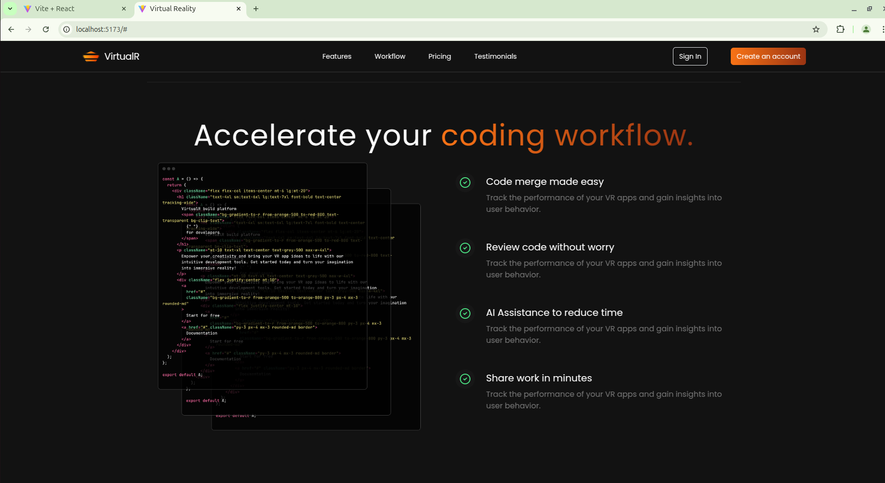
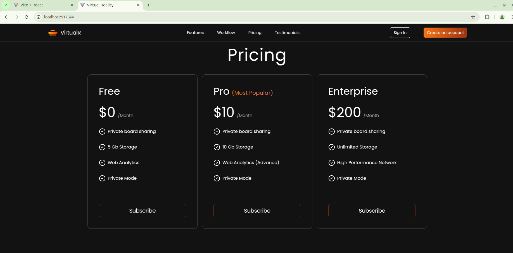
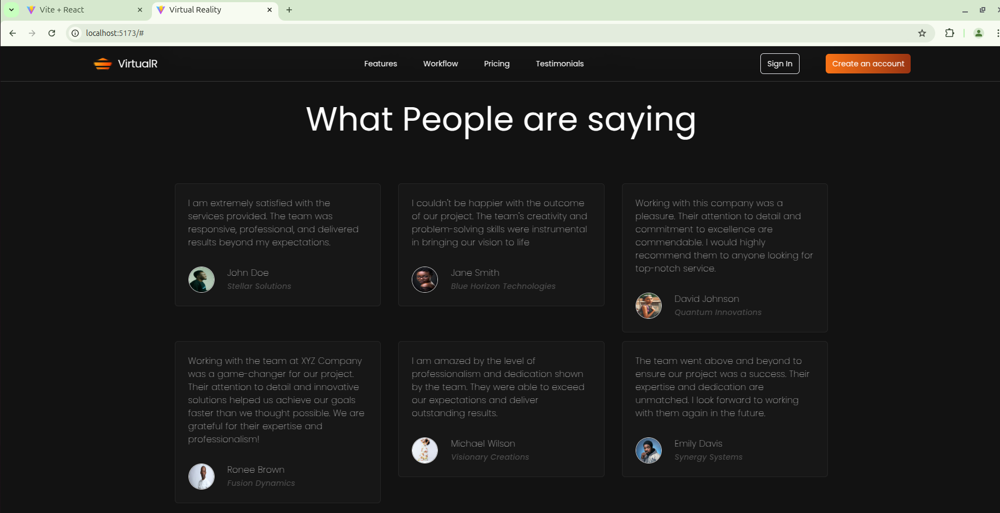
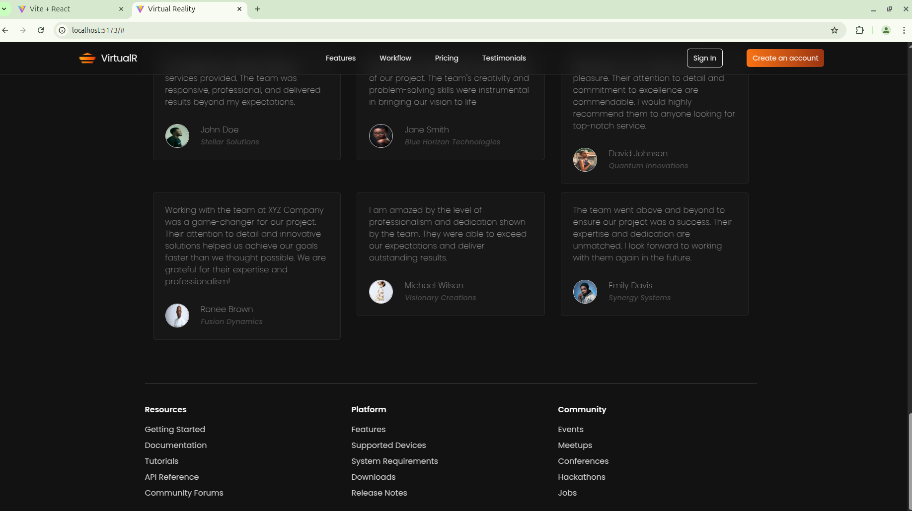

# Virtual Reality App (React + Tailwind CSS)

Welcome to the **Virtual Reality App** built with **React, Tailwind CSS, and Vite**! This project showcases a streamlined coding workflow with modern UI components.

## 📸 Project Screenshots

Here are some screenshots of the application:







---

## 🚀 Getting Started

### 1️⃣ Installation

Follow these steps to set up and run the project:

#### Clone the Repository
```sh
git clone https://github.com/Nyabayo/VirtualReality_React_Tailwind-CSS-with-Vite.git
cd VirtualReality_React_Tailwind-CSS-with-Vite
```

#### Install Dependencies
```sh
npm install
```

#### Start the Development Server
```sh
npm run dev
```

---

## 🎨 Tech Stack

- **React** (Component-based UI development)
- **Vite** (Faster build and optimized performance)
- **Tailwind CSS** (Utility-first styling for rapid development)
- **Lucide-react** (Icon components for UI enhancements)

---

## 📂 Project Structure

```
VirtualReality_React_Tailwind-CSS-with-Vite/
│── src/
│   ├── assets/
│   │   ├── app_screenshots/  # App Screenshots
│   │   ├── profile-pictures/  # User profile images
│   │   ├── code.jpg           # Workflow image
│   ├── components/
│   │   ├── Workflow.jsx       # Coding workflow section
│   │   ├── Navbar.jsx         # Navigation bar
│   │   ├── Testimonials.jsx   # User reviews section
│   ├── constants/index.jsx    # Static data and icons
│   ├── App.jsx                # Main entry component
│   ├── main.jsx               # React entry point
│── public/
│── index.html                 # Main HTML file
│── package.json               # Dependencies and scripts
│── tailwind.config.js         # Tailwind CSS configuration
```

---

## 🛠️ Understanding the Code

### `Workflow.jsx`
This component renders the **"Accelerate your coding workflow"** section with an image and a checklist.

#### Code Breakdown:
- **Uses Tailwind for styling**
- **Maps through `checklistItems`** from `constants/index.jsx` to display features
- **Imports `CheckCircle2`** from `lucide-react` for icons

### `constants/index.jsx`
This file contains:
- **Navigation items**
- **Testimonials** (with user profiles)
- **Feature list** (each with an icon and description)
- **Checklist items** (for workflow section)
- **Pricing plans**

### `tailwind.config.js`
This file customizes Tailwind settings:
```js
/** @type {import('tailwindcss').Config} */
export default {
  content: ["./index.html", "./src/**/*.{js,ts,jsx,tsx}"],
  theme: {
    extend: {},
  },
  plugins: [],
};
```

---

## ✨ Features
✅ **Responsive UI** with Tailwind CSS  
✅ **Fast builds** using Vite  
✅ **Reusable components** for scalability  
✅ **Lucide-react icons** for a modern look  

---

## 🎯 Contributing

Want to improve the project? Follow these steps:
1. Fork the repo 🍴
2. Create a new branch (`git checkout -b feature-name`)
3. Make your changes ✨
4. Commit (`git commit -m "Added a new feature"`)
5. Push (`git push origin feature-name`)
6. Open a Pull Request 🚀

---

## 📬 Contact
For any questions, feel free to reach out! 🚀
WhatsApp: 0758087267
email: ernestosindo9@mail.com

